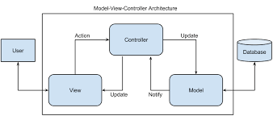
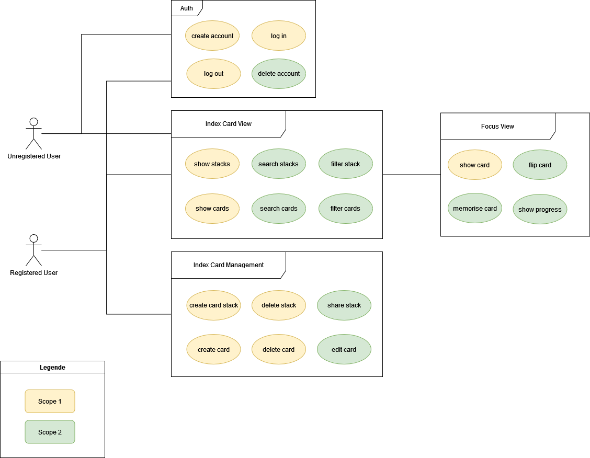
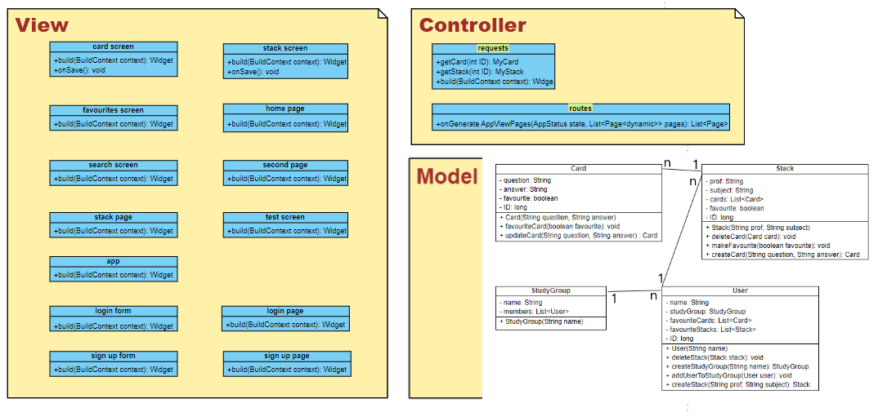
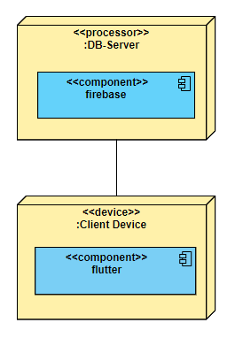

# deX - Software Architecture Document 

# Table of Contents
- [Introduction](#1-introduction)
    - [Purpose](#11-purpose)
    - [Scope](#12-scope)
    - [Definitions, Acronyms and Abbreviations](#13-definitions-acronyms-and-abbreviations)
    - [References](#14-references)
    - [Overview](#15-overview)
- [Architectural Representation](#2-architectural-representation)
- [Architectural Goals and Constraints](#3-architectural-goals-and-constraints)
- [Use-Case View](#4-use-case-view)
- [Logical View](#5-logical-view)
- [Process View](#6-process-view)
- [Deployment View](#7-deployment-view)
- [Implementation View](#8-implementation-view)
    - [Overview](#81-overview)
    - [Layers](#82-layers)
- [Data View](#9-data-view)
- [Size and Performance](#10-size-and-performance)
- [Quality/Metrics](#11-qualitymetrics)

## 1. Introduction

### 1.1 Purpose

This document provides an overview of the software architecture from the deX project, using a number of different architectural views to depict different aspects of the system. It is intended to capture and convey the significant architectural decisions which have been made on the system.

### 1.2 Scope

This document describes the architecture of the deX project.

### 1.3 Definitions, Acronyms and Abbreviations

| Abbrevation | Explanation                            |
| ----------- | -------------------------------------- |
| API         | Application programming interface      |
| MVC         | Model View Controller                  |
| REST        | Representational State Transfer        |
| SDK         | Software Development Kit               |
| SRS         | Software Requirements Specification    |
| UC          | Use case                               |
| VCS         | Version Control System                 |
| N/A         | Not Applicable                         |

### 1.4 References

| Title                                                                      | Date       | Publishing organization   |
| ---------------------------------------------------------------------------|:----------:| ------------------------- |
| [deX Blog](https://dexcards.wordpress.com)                                 | 02.12.2021 | deX Team  
| [GitLab Repository](https://gitlab.com/AlenaSutiagina/dex)                 | 02.12.2021 | deX Team  
| [YouTrack](https://dex-cards.myjetbrains.com/youtrack/agiles/121-2/current)| 02.12.2021 | deX Team  

### 1.5 Overview

This document contains the architectural representation, goals and constraints as well as logical, deployment, implementation and data views.

## 2. Architectural Representation

The deX Project uses the classic MVC structure, which you can see in the following:

## 3. Architectural Goals And Constraints

As already mentioned we using the MVC pattern. For the implementation flutter is used, as you know. In flutter there is the State object as 'the View' and the seperate Dart file with access to the State object as 'The Controller.'

This package involves just two 'new' classes: StateMVC and ControllerMVC. A StateMVC object is a State object with an explicit life-cycle , and a ControllerMVC object can be that separate Dart file with access to the State object (StateMVC in this case). All done with Flutter objects and libraries.
With that, there's now a separation of ‘the Interface’ and ‘the data’ as intended with the MVC architecture.  
'The View' is responsible for 'how' things are displayed. While it is the Controller that determines 'what’ is displayed. The Controller is also concerned with 'how' the app interacts with the user, and so it's involved in the app's event handling.

The View does not care what data it display, it ‘talks to’ the Controller instead. It is the Controller that determines ‘what’ data the View displays. And when a event is trigger, the View again ‘talks to’ the Controller to address the event. 

## 4. Use-Case View

## 5. Logical View

### 5.1 Overview

## 6. Process View

N/A

## 7. Deployment View

## 8. Implementation View

N/A

## 9. Data View

N/A

## 10. Size and Performance

N/A

## 11. Quality/Metrics

N/A

