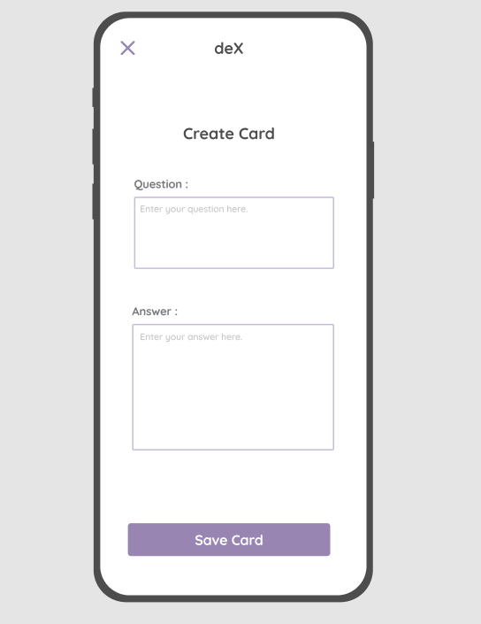
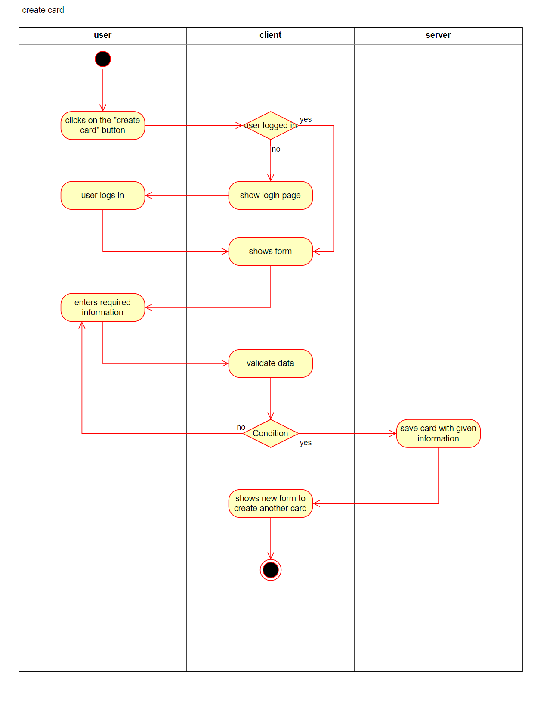
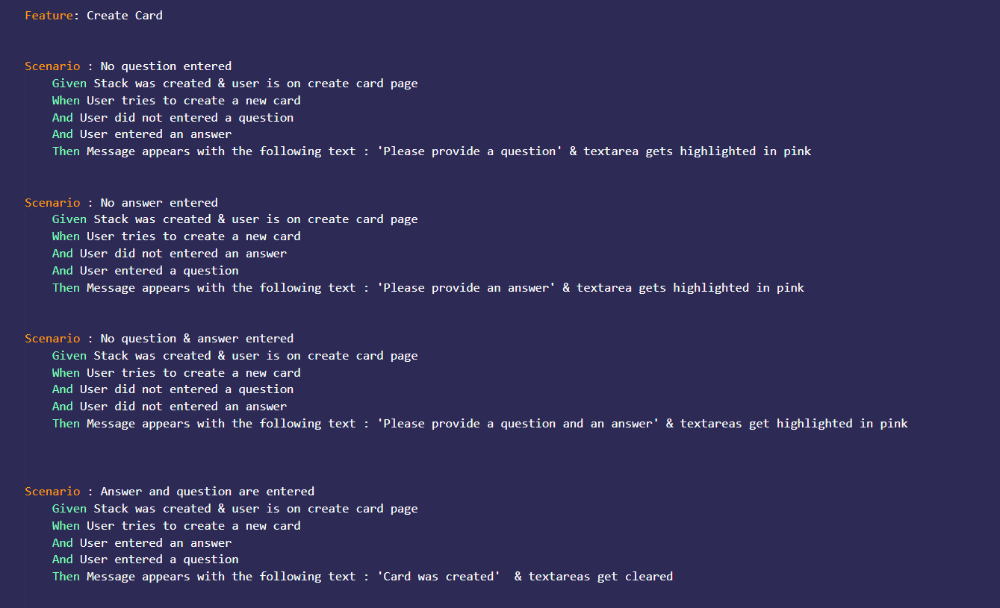

# Use-Case Specification: Creating a card

# 1. Creating a card

## 1.1 Brief Description
This use case allows users to create a new index card in the current card stack.

## 1.2 Mockup 

# 2. Flow of Events

## 2.1 Basic Flow

### Activity Diagram

### .feature File

## 2.2 Alternative Flows
n/a

# 3. Special Requirements
n/a

# 4. Preconditions
The main preconditions for this use case are:

 1. The user is registered.
 2. The user has started the app and has navigated to one stack.

# 5. Postconditions

### 5.1 Save changes / Sync with server
n/a

# 6. Function Points
n/a
