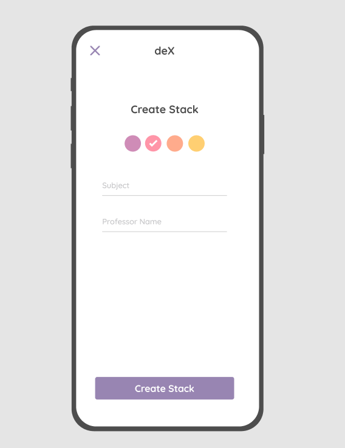
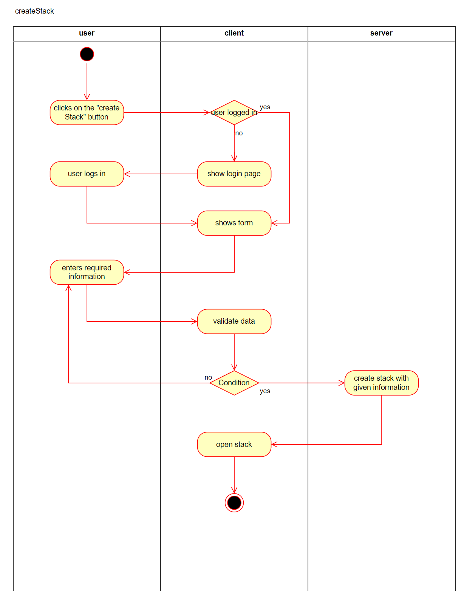

# Use-Case Specification: Creating a stack

# 1. Creating a stack

## 1.1 Brief Description
This use case allows users to create the new index card stack for specific subject and professor.

## 1.2 Mockup 

### Activity Diagram

