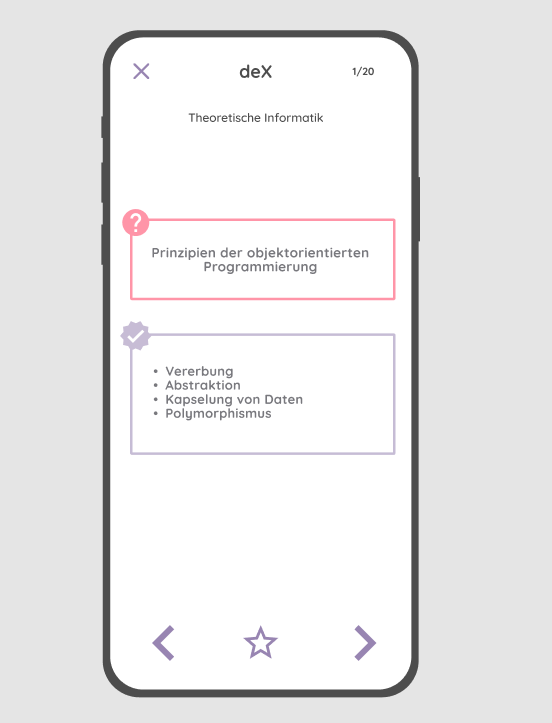
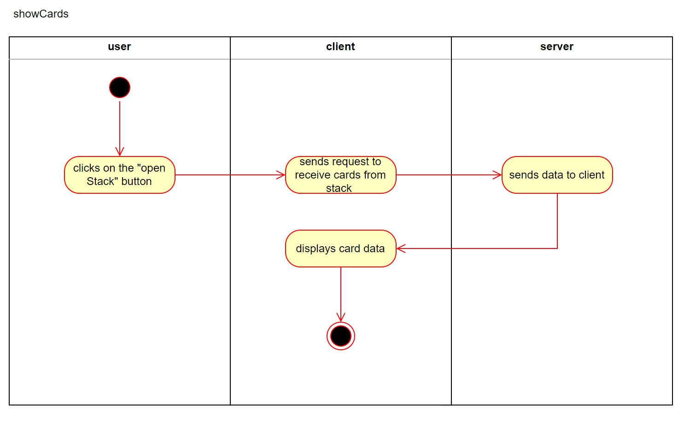

# Use-Case Specification: Showing a card

# 1. Showing a card

## 1.1 Brief Description
This use case allows users to get an overview of one specific card. From here user can either go to the next or previous card or save showed card to favourites.

## 1.2 Mockup 

# 2. Flow of Events

## 2.1 Basic Flow

### Activity Diagram

### .feature File

## 2.2 Alternative Flows
n/a

# 3. Special Requirements
n/a

# 4. Preconditions
The main preconditions for this use case are:

 1. The user has started the app and has navigated to one stack of cards, where has chosen a card for preview.

# 5. Postconditions

### 5.1 Save changes / Sync with server
n/a

# 6. Function Points
n/a
